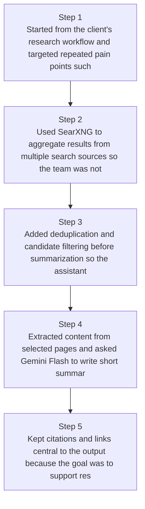
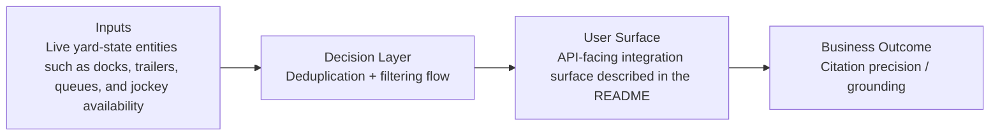
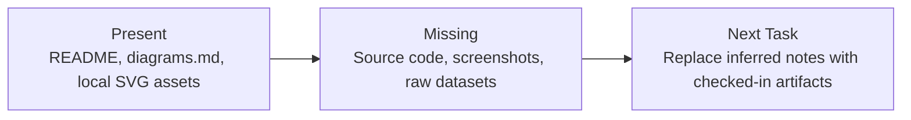

# Private Search Research Assistant Diagrams

Generated on 2026-04-26T04:29:37Z from README narrative plus project blueprint requirements.

## Search aggregation pipeline

## Deduplication + filtering flow

## Evidence Gap Map

